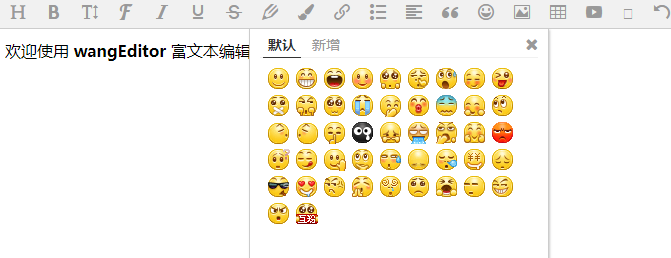
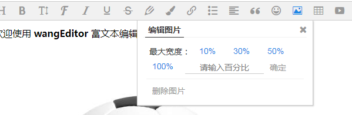

# 对wangEditor进行自己的改编 完全自用 

## 原文介绍如下 （对原作者编写出这样出色的国人编辑器表示敬意）

**wangEditor** —— 轻量级 web 富文本编辑器，配置方便，使用简单。支持 IE10+ 浏览器。

- 官网：[www.wangEditor.com](http://www.wangeditor.com/)
- 文档：[www.kancloud.cn/wangfupeng/wangeditor3/332599](http://www.kancloud.cn/wangfupeng/wangeditor3/332599)
- 源码：[github.com/wangfupeng1988/wangEditor](https://github.com/wangfupeng1988/wangEditor) （欢迎 star）


*查看 v2 版本的代码和文档点击[这里](https://github.com/wangfupeng1988/wangEditor/tree/v2)*


## 使用 注意最新版只能对div框架进行渲染

```javascript
var E = window.wangEditor
var editor = new E('#div1')
editor.create()
```


## 关于作者

- 关注作者的博客 - 《[深入理解javascript原型和闭包系列](http://www.cnblogs.com/wangfupeng1988/p/4001284.html)》《[深入理解javascript异步系列](https://github.com/wangfupeng1988/js-async-tutorial)》《[换个思路学习nodejs](https://github.com/wangfupeng1988/node-tutorial)》《[CSS知多少](http://www.cnblogs.com/wangfupeng1988/p/4325007.html)》 
- 学习作者的教程 - 《[前端JS高级面试](https://coding.imooc.com/class/190.html)》《[前端JS基础面试题](http://coding.imooc.com/class/115.html)》《[React.js模拟大众点评webapp](http://coding.imooc.com/class/99.html)》《[zepto设计与源码分析](http://www.imooc.com/learn/745)》《[json2.js源码解读](http://study.163.com/course/courseMain.htm?courseId=691008)》


## 自己改动的地方
- 1、增加图片的百分比自定义
- 2、修改字体颜色和背景色图标 包括处理(有待改进处 白色)
- 3、修改了face为本地图像 新增了一个参数 emotionPath
    editor.customConfig.emotionPath = '/images/face/';


## 需要进一步学习的地方
- 如何把woff文件嵌入到css，还需学习 [了解woff2字体及转换](https://www.zhangxinxu.com/wordpress/2018/07/known-woff2-mime-convert/)
  转换地址为[地址](https://www.zhangxinxu.com/sp/base64.html)
- 下一步把全屏和源码显示从插件中集成到js中

